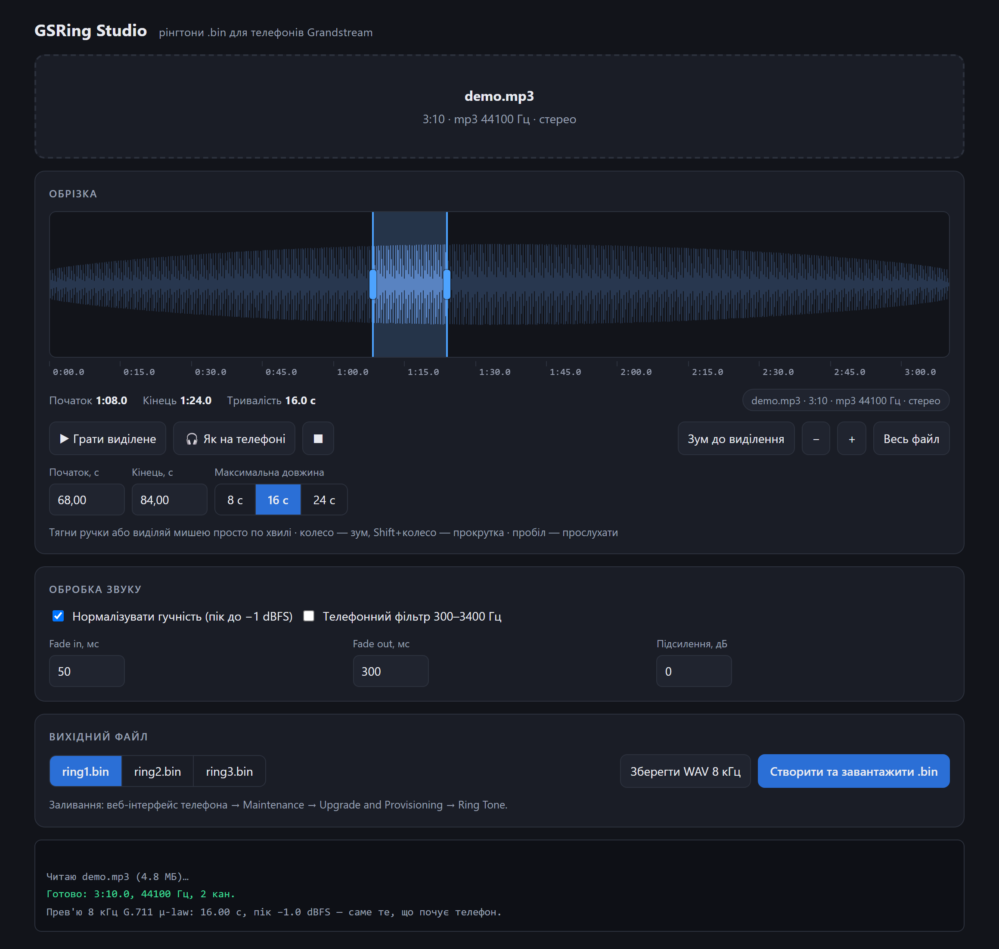

# GSRing

Turn any audio or video file into a `ring1.bin` ringtone for **Grandstream IP phones** — trim it
on a waveform, hear exactly what the phone will play, download the file.

One 36 KB executable. No Python, no Node, no FFmpeg, no installer, no admin rights.

*[Українська версія](README.uk.md) · the app's interface is in Ukrainian.*



## Why this exists

Grandstream phones accept custom ringtones only as `.bin` files in an undocumented container:
a 512-byte header followed by raw G.711 μ-law, 8 kHz, mono. The official converter
(`ringtool.exe` — a Texas Instruments utility from the early 2000s) has two hard limits:

* it reads **nothing but 16-bit PCM `.wav`**, so every MP3 needs a separate conversion first;
* it has **no trimming at all** — you get the first 8, 16 or 24 seconds of the file, and that's it.

GSRing does the whole thing in one window: drop in an MP3 or an MP4, drag out the exact
fragment you want, and get a `.bin` the phone accepts.

## Run it

Double-click **`GSRing.exe`**. That's the entire installation.

The exe carries the app as an embedded HTML page. On start it unpacks the page to
`%LOCALAPPDATA%\GSRing` and opens it in an app-mode browser window — no address bar, no tabs.
Everything — decoding, resampling, μ-law encoding, header assembly — runs locally in the
rendering engine Windows already ships. **No file ever leaves your machine.**

Requirements: Windows 10/11 (it uses the built-in .NET Framework and Edge). Chrome is used
instead if Edge is missing.

You can also open `src/index.html` directly in any modern browser, or host it on any static
hosting — it is a self-contained, offline page.

## What it does

* **Input:** anything the browser can decode — mp3, wav, m4a, aac, ogg, opus, flac, mp4, webm.
* **Trimming:** full-width waveform, drag-select, start/end handles, draggable region.
  Wheel zooms around the cursor, Shift+wheel scrolls.
* **Length limit** of 8 / 16 / 24 s is enforced while dragging: the region refuses to stretch
  further and the opposite edge stays put.
* **Preview:** Space plays the selection at full quality; *"Як на телефоні"* plays it after
  G.711 μ-law at 8 kHz — literally what will come out of the phone's speaker.
* **Processing:** peak normalisation to −1 dBFS, gain in dB, fade in/out, optional
  300–3400 Hz telephone band-pass.
* **Output:** `ring1.bin` / `ring2.bin` / `ring3.bin`, plus an intermediate 8 kHz WAV if needed.
  Header size and checksum are validated before the file is handed to you.

## The file format

Reverse-engineered from `ringtool.exe`. 512-byte header, then raw G.711 μ-law,
8000 Hz, mono, one byte per sample.

| Offset | Type | Meaning |
|--------|------|---------|
| `0x000` | u32 BE | total file size in 16-bit words (`size / 2`) |
| `0x004` | u16 BE | checksum: the sum of every u16 BE word in the file ≡ 0 (mod 2¹⁶) |
| `0x006` | char[4] | `"1.1."` — version tag |
| `0x00A` | u16 BE | year |
| `0x00C`…`0x00F` | u8 ×4 | month, day, hour, minute |
| `0x010` | char[] | `"ring.bin"`, zero-padded |
| `0x027` | u8 | `0xC8` |
| `0x104` | u32 BE | duplicate of the size field at `0x000` |
| `0x150` | u8 | `0x20` |
| `0x200` | payload | G.711 μ-law |

Two notes on the size field. It is **32-bit**: in files under 128 KB the upper half is zero,
which is why it is easy to mistake for a 16-bit field with padding — but 24 seconds produce
192512 bytes (96256 words), which no longer fits in 16 bits. And `ringtool.exe` writes its
header into the same buffer as the audio, so it silently drops the last 512 samples (0.064 s);
GSRing keeps the whole fragment and sizes the header correctly.

## How it was verified

* Both implementations rebuild a reference `ring1.bin` produced by the original `ringtool.exe`
  **byte for byte**, checksum included.
* The μ-law encoder was compared against Python's `audioop` across all 65536 input values.
* The full pipeline, the drag handles and the pixel accuracy of the selection were exercised
  inside a real Chrome instance over the DevTools Protocol.

One caveat: 8 and 16 second output is checked against a reference file from the original tool.
24 seconds exceeds the size of any reference available, so that mode rests on the format
reading above — worth a quick test on the actual phone.

## Building

Run **`build.cmd`**. It uses the C# compiler that ships with Windows (.NET Framework) — there
is nothing to install. Rebuild after editing `src/index.html` or `src/GSRing.cs`.

## Command line (optional)

`src/gsring.py` is a standalone CLI for batch work and for formats browsers can't read
(mkv, avi, wma). Python 3.10+, standard library only — no `requirements.txt` needed —
plus `ffmpeg` on `PATH`.

```bash
python src/gsring.py song.mp3  -o ring1.bin -s 42 -l 16     # 16 s starting at 0:42
python src/gsring.py video.mp4 -o ring2.bin --phone-filter --gain 3
python src/gsring.py ring1.bin --inspect                    # dump an existing .bin
```

## Getting it onto the phone

Phone web UI → **Maintenance → Upgrade and Provisioning → Ring Tone**, or drop `ring1.bin` on
your TFTP/HTTP provisioning server. Then pick Custom Ring Tone 1/2/3 on the handset.

## Repository layout

| Path | Role |
|------|------|
| `GSRing.exe` | the shipped application |
| `src/index.html` | the app itself; embedded into the exe, works standalone too |
| `src/GSRing.cs` | the launcher that hosts the page |
| `src/gsring.py` | optional CLI |
| `build.cmd` | rebuild script |

## License

MIT — see [LICENSE](LICENSE).
